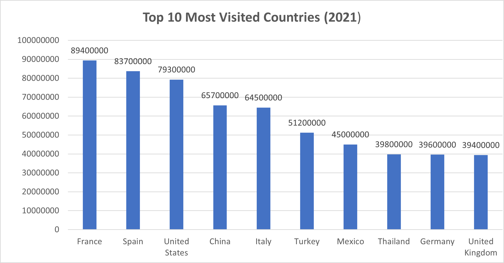

# 🌍 Most Visited Countries in the World (2021)

## 📊 Project Overview
This project analyzes the 50 most visited countries in the world based on international tourist arrivals.

The goal is to identify global tourism patterns and highlight the most popular destinations worldwide using data analysis in Excel.

---

## 📁 Dataset
- Source: Kaggle  
- Dataset: Most Visited Countries in the World  
- Countries: 50  
- Variables: Country, Tourist Arrivals  
- Year: 2021 (based on dataset description)

---

## 🧹 Data Preparation

Two datasets were provided:
- A ranking file (100 countries)
- A tourist arrivals file (50 countries)

An inconsistency was found between both files, so the analysis focuses on the tourist arrivals dataset, which contains the actual numerical values.

---

## 📈 Exploratory Data Analysis

The analysis focused on:
- Identifying the top visited countries
- Ranking international tourism destinations
- Understanding distribution patterns across countries

---

## 🏆 Key Insights

- France is the most visited country in the dataset.
- Spain and the United States follow in second and third place.
- Tourism is highly concentrated in a small number of countries, mainly in Europe and North America.

---

## 📊 Visualization

---

## 🛠 Tools Used
- Microsoft Excel
- Data cleaning
- Data visualization
- Exploratory Data Analysis (EDA)

- ## 🧠 Conclusion

This analysis shows that global tourism is concentrated in a small number of countries, mainly in Europe and North America.

France ranks first in international tourist arrivals, followed by Spain and the United States.

The dataset provides a useful snapshot of global tourism patterns, but it does not include time variation or reasons for travel, which limits deeper analysis.
